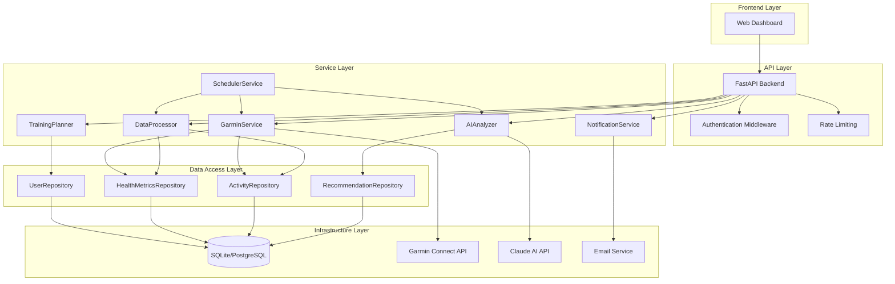

# System Architecture

## Overview

The AI-Powered Training Optimization System is a FastAPI-based web application that integrates Garmin fitness data with Claude AI analysis to provide intelligent training recommendations and insights.

## Architecture Philosophy

The system follows a **layered service-oriented architecture** with clear separation of concerns:

- **Presentation Layer**: Web dashboard and REST API
- **Application Layer**: Business logic and service orchestration
- **Domain Layer**: Core business entities and rules
- **Infrastructure Layer**: External integrations and data persistence

## System Components

### 1. Web Dashboard (Frontend)
- User interface for viewing analytics and recommendations
- Real-time data visualization
- Training plan management
- Notification preferences

### 2. FastAPI Backend (API Layer)
- RESTful API endpoints
- Request validation (Pydantic models)
- Authentication and authorization
- Rate limiting and throttling
- OpenAPI documentation (Swagger UI)

### 3. Service Layer
Core business logic isolated from infrastructure concerns:

#### GarminService
- **Responsibility**: Fetch data from Garmin Connect API
- **Operations**:
  - Authenticate with Garmin Connect
  - Fetch health metrics (HR, sleep, stress, steps)
  - Fetch activity data (workouts, GPS tracks)
  - Handle rate limiting and retries
- **Error Handling**: Connection failures, authentication errors, rate limits

#### AIAnalyzer
- **Responsibility**: Claude AI integration for intelligent analysis
- **Operations**:
  - Analyze training load and recovery
  - Generate personalized recommendations
  - Identify patterns and anomalies
  - Provide workout suggestions
- **Error Handling**: API failures, token limits, parsing errors

#### DataProcessor
- **Responsibility**: Aggregate and transform raw data
- **Operations**:
  - Calculate training load metrics (TSS, CTL, ATL, TSB)
  - Compute aggregate statistics
  - Detect trends and patterns
  - Data normalization and cleaning
- **Error Handling**: Invalid data, missing values, calculation errors

#### TrainingPlanner
- **Responsibility**: Generate and adapt training plans
- **Operations**:
  - Create periodized training plans
  - Adapt plans based on performance
  - Schedule workouts
  - Track plan adherence
- **Error Handling**: Invalid plan parameters, conflicting schedules

#### NotificationService
- **Responsibility**: Multi-channel notifications
- **Operations**:
  - Email notifications (training reminders, insights)
  - SMS notifications (optional)
  - In-app notifications
  - Notification preferences management
- **Error Handling**: Delivery failures, invalid contacts

#### SchedulerService
- **Responsibility**: Automated background tasks
- **Operations**:
  - Daily Garmin data sync (configurable time)
  - Weekly AI analysis generation
  - Data cleanup and archival
  - Health checks and monitoring
- **Error Handling**: Task failures, retry logic, alerting

### 4. Data Access Layer
- **Repository Pattern**: Abstract database operations
- **Repositories**:
  - UserRepository
  - HealthMetricsRepository
  - ActivityRepository
  - RecommendationRepository
  - TrainingPlanRepository
- **Benefits**: Database abstraction, testability, future migration path

### 5. Database (SQLite → PostgreSQL)
- **Current**: SQLite for simplicity
- **Future**: PostgreSQL for production scale
- **Schema Design**:
  - Users and authentication
  - Health metrics (time-series data)
  - Activities and workouts
  - AI analysis and recommendations
  - Training plans and schedules
  - Notification history

### 6. External Integrations
- **Garmin Connect**: Unofficial API (garminconnect library)
- **Claude AI**: Anthropic API for analysis
- **Email Service**: SMTP or SendGrid
- **SMS Service**: Twilio (optional)

### 7. Background Task Scheduler
- **Technology**: APScheduler or Celery
- **Tasks**:
  - Daily sync job
  - Weekly analysis job
  - Data cleanup job
  - Health monitoring job

## Component Diagram

See `diagrams/system_architecture.mmd` for visual representation.



## Service Layer Design Pattern

### Pattern: Service-Repository-Entity

```python
# Service Layer (Business Logic)
class GarminService:
    def __init__(self, garmin_client, health_repo, activity_repo):
        self.garmin_client = garmin_client
        self.health_repo = health_repo
        self.activity_repo = activity_repo

    async def sync_health_data(self, user_id: str, date: date) -> HealthMetrics:
        # Business logic orchestration
        # Error handling and retry logic
        # Data transformation
        # Repository calls
        pass

# Repository Layer (Data Access)
class HealthMetricsRepository:
    def __init__(self, db_session):
        self.db = db_session

    async def save_health_metrics(self, metrics: HealthMetrics) -> None:
        # Database operations
        pass

    async def get_health_metrics(self, user_id: str, date_range: tuple) -> list[HealthMetrics]:
        # Query operations
        pass

# Entity Layer (Domain Models)
class HealthMetrics(BaseModel):
    user_id: str
    date: date
    resting_hr: int
    hrv: float
    sleep_hours: float
    stress_score: int
    # ... other fields
```

### Dependency Injection

Services are injected via FastAPI's dependency injection system:

```python
# app/core/dependencies.py
def get_garmin_service() -> GarminService:
    return GarminService(
        garmin_client=get_garmin_client(),
        health_repo=HealthMetricsRepository(get_db()),
        activity_repo=ActivityRepository(get_db())
    )

# app/api/routes/health.py
@router.get("/health/metrics")
async def get_health_metrics(
    garmin_service: GarminService = Depends(get_garmin_service)
):
    return await garmin_service.get_health_metrics()
```

## Data Flow Architecture

### 1. Data Ingestion Flow

```
User Request → API Endpoint → GarminService → Garmin API
                                    ↓
                          Validate & Transform
                                    ↓
                          HealthMetricsRepository
                                    ↓
                          SQLite/PostgreSQL Database
```

### 2. AI Analysis Flow

```
Scheduled Job → SchedulerService → DataProcessor
                                        ↓
                              Aggregate Metrics (7/30/90 days)
                                        ↓
                                  AIAnalyzer → Claude API
                                        ↓
                              Parse & Validate Response
                                        ↓
                              RecommendationRepository → Database
                                        ↓
                              NotificationService → Email User
```

### 3. Dashboard Data Flow

```
User → Dashboard → API Request → FastAPI Router
                                      ↓
                              DataProcessor (cached)
                                      ↓
                          Query Multiple Repositories
                                      ↓
                          Aggregate & Format Response
                                      ↓
                          Return JSON → Dashboard Render
```

## Error Handling Strategy

### 1. Error Hierarchy

```
AppException (Base)
├── ExternalAPIError
│   ├── GarminAPIError
│   │   ├── GarminAuthenticationError
│   │   ├── GarminConnectionError
│   │   └── GarminRateLimitError
│   └── AIAnalysisError
│       ├── ClaudeAPIError
│       ├── ClaudeTokenLimitError
│       └── ClaudeParsingError
├── DataError
│   ├── DataValidationError
│   ├── DataProcessingError
│   └── DataNotFoundError
└── DatabaseError
    ├── DatabaseConnectionError
    └── DatabaseIntegrityError
```

### 2. Error Handling Patterns

#### Retry with Exponential Backoff
```python
@retry(
    stop=stop_after_attempt(3),
    wait=wait_exponential(multiplier=1, min=4, max=10),
    retry=retry_if_exception_type(GarminConnectionError)
)
async def fetch_garmin_data():
    # API call
    pass
```

#### Graceful Degradation
```python
async def get_dashboard_data(user_id: str):
    try:
        # Try fresh data
        return await garmin_service.fetch_latest_data(user_id)
    except GarminAPIError as e:
        logger.warning(f"Garmin API unavailable, using cached data: {e}")
        # Fallback to cached data
        return await cache.get_cached_dashboard_data(user_id)
```

#### Circuit Breaker Pattern
```python
# Prevent cascading failures to external APIs
@circuit_breaker(failure_threshold=5, recovery_timeout=60)
async def call_claude_api(prompt: str):
    # Claude API call
    pass
```

### 3. Error Response Format

```json
{
  "error": {
    "code": "GARMIN_AUTH_FAILED",
    "message": "Unable to authenticate with Garmin Connect",
    "details": "Invalid credentials or session expired",
    "timestamp": "2025-10-15T10:30:00Z",
    "request_id": "req_abc123"
  }
}
```

## Logging Strategy

### 1. Logging Levels

- **DEBUG**: Detailed diagnostic information (development only)
- **INFO**: General informational messages (API calls, job completions)
- **WARNING**: Warning messages (degraded service, retry attempts)
- **ERROR**: Error events (handled exceptions)
- **CRITICAL**: Critical failures requiring immediate attention

### 2. Structured Logging

```python
import structlog

logger = structlog.get_logger()

# Context-rich logging
logger.info(
    "garmin_sync_completed",
    user_id=user_id,
    date=sync_date,
    metrics_count=len(metrics),
    duration_ms=duration,
    request_id=request_id
)
```

### 3. Log Aggregation

- **Development**: Console output with pretty formatting
- **Production**: JSON logs → CloudWatch/ELK/Datadog
- **Correlation**: Request ID tracking across all log entries

### 4. Key Logging Points

- API request/response (with sanitized data)
- External API calls (Garmin, Claude)
- Database operations (queries, errors)
- Background job execution
- Authentication events
- Error occurrences with stack traces

## Caching Strategy

### 1. Cache Layers

#### Application Cache (Redis/In-Memory)
```python
# Cache frequently accessed data
@cache(ttl=300)  # 5 minutes
async def get_user_dashboard_summary(user_id: str):
    # Expensive aggregation query
    pass
```

#### HTTP Response Cache
```python
# Cache API responses
@router.get("/api/health/metrics",
    response_model=HealthMetricsResponse,
    cache_control="max-age=300"  # 5 minutes
)
```

#### Database Query Cache
```python
# Cache expensive queries
SELECT * FROM health_metrics
WHERE user_id = ? AND date >= ?
ORDER BY date DESC
-- Cached for 5 minutes per user
```

### 2. Cache Invalidation

- **Time-based**: TTL (Time To Live) for auto-expiration
- **Event-based**: Invalidate on data updates
- **User-triggered**: Manual refresh option

### 3. Cache Keys Structure

```
garmin_ai:user:{user_id}:health:latest
garmin_ai:user:{user_id}:activities:{date}
garmin_ai:user:{user_id}:dashboard:summary
garmin_ai:analysis:{user_id}:{date_range}
```

### 4. Cached Data

- Dashboard summary data (5 minutes)
- Health metrics (1 hour for historical data)
- AI analysis results (24 hours)
- Training plans (until modified)
- Aggregated statistics (30 minutes)

## Security Considerations

### 1. Authentication & Authorization

- **JWT Tokens**: Stateless authentication
- **Token Refresh**: Short-lived access tokens (15 min), long-lived refresh tokens (7 days)
- **Password Hashing**: bcrypt with salt
- **Session Management**: Secure session storage

### 2. API Security

- **HTTPS Only**: TLS 1.3 encryption
- **CORS**: Strict origin policies
- **Rate Limiting**: Per-user and per-IP limits
- **Input Validation**: Pydantic schema validation
- **SQL Injection Prevention**: Parameterized queries (SQLAlchemy ORM)

### 3. Secrets Management

- **Environment Variables**: API keys, database credentials
- **Secret Rotation**: Regular credential updates
- **No Hardcoded Secrets**: All secrets externalized
- **.env File**: Excluded from version control

### 4. Data Protection

- **Encryption at Rest**: Database encryption (future PostgreSQL)
- **Encryption in Transit**: HTTPS/TLS
- **PII Protection**: Minimal data collection, anonymization where possible
- **Data Retention**: Configurable retention policies

### 5. Garmin Credentials Storage

- **Encrypted Storage**: User Garmin credentials encrypted with Fernet
- **Per-User Encryption**: Separate encryption keys
- **No Plaintext**: Credentials never stored in plaintext
- **Secure Retrieval**: Decryption only during API calls

### 6. Third-Party API Security

- **API Key Rotation**: Regular Claude AI key rotation
- **Rate Limiting**: Respect API provider limits
- **Error Handling**: No sensitive data in error messages
- **Audit Logging**: Track all external API calls

## Scalability Considerations

### Current Architecture (Phase 1)
- Single FastAPI instance
- SQLite database
- In-memory caching
- Single-user focus

### Future Scalability (Phase 2)
- **Horizontal Scaling**: Multiple FastAPI instances behind load balancer
- **Database**: Migration to PostgreSQL with read replicas
- **Caching**: Redis cluster for distributed caching
- **Background Jobs**: Celery with Redis/RabbitMQ
- **Message Queue**: Async job processing
- **CDN**: Static asset delivery

### Performance Targets
- API Response Time: < 200ms (p95)
- Dashboard Load Time: < 2 seconds
- Data Sync Time: < 30 seconds
- AI Analysis Time: < 10 seconds

## Monitoring & Observability

### Health Checks
- `/health`: Basic health check
- `/health/detailed`: Component health (database, external APIs)
- `/metrics`: Prometheus-compatible metrics

### Key Metrics
- API request rate and latency
- Error rates by endpoint
- External API success rates
- Background job completion rates
- Database query performance
- Cache hit rates

### Alerting
- High error rates
- External API failures
- Background job failures
- Database connection issues
- Unusual user activity

## Technology Stack Summary

- **Backend Framework**: FastAPI (Python 3.11+)
- **Database**: SQLite (dev) → PostgreSQL (prod)
- **ORM**: SQLAlchemy 2.0 with async support
- **Authentication**: JWT (python-jose)
- **Background Jobs**: APScheduler or Celery
- **Caching**: Redis or in-memory (functools.lru_cache)
- **Logging**: structlog
- **Validation**: Pydantic v2
- **API Client**: httpx (async HTTP client)
- **Testing**: pytest with pytest-asyncio
- **Documentation**: OpenAPI/Swagger (auto-generated)

## Deployment Architecture

### Development
- Single container with FastAPI + SQLite
- Local development environment
- Hot reload enabled

### Production
- Docker containers orchestrated with Docker Compose or Kubernetes
- FastAPI application container
- PostgreSQL database container
- Redis cache container
- Nginx reverse proxy
- Background job worker container

## Next Steps

1. Implement core service layer interfaces
2. Create database models and repositories
3. Implement API endpoints with OpenAPI documentation
4. Set up authentication and authorization
5. Implement background job scheduler
6. Add comprehensive error handling
7. Set up logging and monitoring
8. Write integration tests
9. Deploy to production environment
10. Monitor and optimize based on real usage
