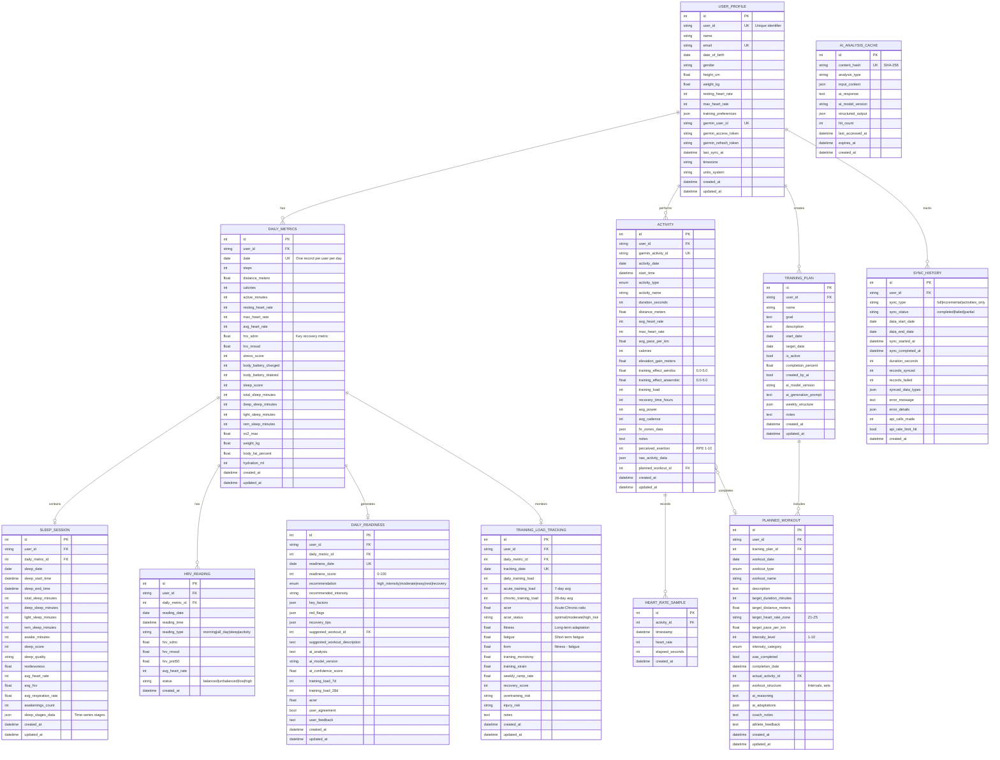

# Database Schema Documentation

## Overview

The Garmin AI Training Optimization System uses a relational database (SQLite/PostgreSQL) to store comprehensive fitness data, AI-generated recommendations, and training plans. The schema is designed for:

- **Efficient querying** with strategic indexes on date and user_id fields
- **Data integrity** with foreign key constraints and unique constraints
- **Scalability** with proper normalization and relationship management
- **Flexibility** with JSON fields for semi-structured data
- **Time-series data** with optimized storage for metrics and samples

## Entity-Relationship Diagram



## Core Tables

### 1. user_profile

**Purpose**: Central user information and Garmin integration credentials.

**Key Fields**:
- `user_id`: Unique identifier for the user (not auto-increment for flexibility)
- `garmin_user_id`, `garmin_access_token`, `garmin_refresh_token`: Garmin OAuth credentials
- `training_preferences`: JSON field storing workout preferences, goals, available training days
- `last_sync_at`: Timestamp of last successful Garmin sync

**Indexes**:
- Primary key on `id`
- Unique index on `user_id`
- Unique index on `email`
- Unique index on `garmin_user_id`

**Relationships**:
- One-to-many with daily_metrics, activities, training_plans, sync_history

---

### 2. daily_metrics

**Purpose**: Daily aggregated health and fitness metrics (one row per user per day).

**Key Fields**:
- `date`: The date these metrics represent
- `hrv_sdnn`: Heart Rate Variability (key recovery indicator)
- `body_battery_charged/drained`: Garmin's energy management metric
- `sleep_score`: Overall sleep quality (0-100)
- `vo2_max`: Cardiorespiratory fitness estimate
- `stress_score`: Daily stress level (0-100)

**Indexes**:
- Primary key on `id`
- Unique composite index on `(user_id, date)`
- Index on `user_id`
- Index on `date`

**Constraints**:
- Unique constraint on `(user_id, date)` ensures one record per user per day

**Relationships**:
- Many-to-one with user_profile
- One-to-one with sleep_session
- One-to-many with hrv_readings
- One-to-one with daily_readiness
- One-to-one with training_load_tracking

**Query Patterns**:
```sql
-- Get last 7 days of metrics
SELECT * FROM daily_metrics
WHERE user_id = ? AND date >= DATE('now', '-7 days')
ORDER BY date DESC;

-- Get HRV trend
SELECT date, hrv_sdnn, resting_heart_rate
FROM daily_metrics
WHERE user_id = ? AND date >= DATE('now', '-30 days')
ORDER BY date;
```

---

### 3. sleep_sessions

**Purpose**: Detailed sleep session data with sleep stages breakdown.

**Key Fields**:
- `sleep_start_time`, `sleep_end_time`: Precise sleep timing
- `deep_sleep_minutes`, `light_sleep_minutes`, `rem_sleep_minutes`: Sleep stage durations
- `sleep_stages_data`: JSON array of sleep stage transitions with timestamps
- `avg_hrv`: HRV during sleep (indicator of recovery quality)
- `restlessness`: Movement during sleep

**Indexes**:
- Primary key on `id`
- Unique index on `daily_metric_id` (one-to-one relationship)
- Composite index on `(user_id, sleep_date)`
- Index on `sleep_start_time`

**Relationships**:
- One-to-one with daily_metrics
- Many-to-one with user_profile (via daily_metrics)

**Query Patterns**:
```sql
-- Get sleep quality trend
SELECT sleep_date, sleep_score, total_sleep_minutes, deep_sleep_minutes
FROM sleep_sessions
WHERE user_id = ?
ORDER BY sleep_date DESC
LIMIT 14;
```

---

### 4. activities

**Purpose**: Individual workout/activity records from Garmin.

**Key Fields**:
- `garmin_activity_id`: Unique Garmin identifier (prevents duplicates)
- `activity_type`: Enum of activity types (running, cycling, etc.)
- `training_effect_aerobic/anaerobic`: Garmin's training benefit metrics (0.0-5.0)
- `training_load`: Workout intensity score
- `recovery_time_hours`: Recommended recovery duration
- `hr_zones_data`: JSON with time spent in each heart rate zone
- `planned_workout_id`: Links to prescribed workout (if applicable)

**Indexes**:
- Primary key on `id`
- Unique index on `garmin_activity_id`
- Composite index on `(user_id, activity_date)`
- Index on `activity_type`
- Index on `activity_date`

**Relationships**:
- Many-to-one with user_profile
- One-to-many with heart_rate_samples
- Many-to-one with planned_workouts (optional)

**Query Patterns**:
```sql
-- Get recent running activities
SELECT * FROM activities
WHERE user_id = ? AND activity_type = 'running'
ORDER BY activity_date DESC
LIMIT 10;

-- Calculate weekly training load
SELECT
    DATE(activity_date, 'weekday 0', '-6 days') as week_start,
    SUM(training_load) as weekly_load,
    COUNT(*) as activity_count
FROM activities
WHERE user_id = ? AND activity_date >= DATE('now', '-8 weeks')
GROUP BY week_start
ORDER BY week_start;
```

---

### 5. heart_rate_samples

**Purpose**: High-resolution heart rate data during activities.

**Key Fields**:
- `timestamp`: When the sample was recorded
- `heart_rate`: Heart rate in BPM
- `elapsed_seconds`: Seconds since activity start (for alignment)

**Indexes**:
- Primary key on `id`
- Index on `activity_id`
- Index on `timestamp`

**Relationships**:
- Many-to-one with activities (cascade delete when activity is deleted)

**Storage Considerations**:
- This table can grow large quickly (1 sample/second = 3600 samples/hour)
- Consider partitioning by date for large datasets
- May archive older samples if storage becomes an issue

**Query Patterns**:
```sql
-- Get heart rate profile for an activity
SELECT elapsed_seconds, heart_rate
FROM heart_rate_samples
WHERE activity_id = ?
ORDER BY elapsed_seconds;

-- Calculate heart rate zone distribution
SELECT
    CASE
        WHEN heart_rate < 120 THEN 'Z1'
        WHEN heart_rate < 140 THEN 'Z2'
        WHEN heart_rate < 160 THEN 'Z3'
        WHEN heart_rate < 180 THEN 'Z4'
        ELSE 'Z5'
    END as zone,
    COUNT(*) as samples
FROM heart_rate_samples
WHERE activity_id = ?
GROUP BY zone;
```

---

### 6. hrv_readings

**Purpose**: Heart Rate Variability readings throughout the day.

**Key Fields**:
- `reading_type`: morning, all_day, sleep, or activity
- `hrv_sdnn`: Standard deviation of NN intervals (primary HRV metric)
- `hrv_rmssd`: Root mean square of successive differences
- `hrv_pnn50`: Percentage of intervals differing by >50ms
- `status`: balanced, unbalanced, low, or high

**Indexes**:
- Primary key on `id`
- Composite index on `(user_id, reading_date)`
- Index on `reading_type`

**Relationships**:
- Many-to-one with daily_metrics
- Many-to-one with user_profile (via daily_metrics)

**Query Patterns**:
```sql
-- Get morning HRV trend (best for recovery tracking)
SELECT reading_date, hrv_sdnn, status
FROM hrv_readings
WHERE user_id = ? AND reading_type = 'morning'
ORDER BY reading_date DESC
LIMIT 30;

-- Calculate HRV baseline
SELECT AVG(hrv_sdnn) as baseline, STDDEV(hrv_sdnn) as std_dev
FROM hrv_readings
WHERE user_id = ?
  AND reading_type = 'morning'
  AND reading_date >= DATE('now', '-60 days');
```

---

### 7. training_plans

**Purpose**: Structured training programs with goals and timelines.

**Key Fields**:
- `goal`: Free-text goal description (e.g., "Complete 5K in under 25 minutes")
- `start_date`, `target_date`: Plan timeline
- `is_active`: Whether this plan is currently active
- `created_by_ai`: Indicates AI-generated vs user-created plans
- `weekly_structure`: JSON defining weekly periodization
- `completion_percent`: Progress tracking

**Indexes**:
- Primary key on `id`
- Composite index on `(user_id, is_active)`
- Composite index on `(start_date, target_date)`

**Relationships**:
- Many-to-one with user_profile
- One-to-many with planned_workouts

**Query Patterns**:
```sql
-- Get active training plan
SELECT * FROM training_plans
WHERE user_id = ? AND is_active = 1
LIMIT 1;

-- Get plan progress
SELECT
    tp.name,
    tp.goal,
    COUNT(pw.id) as total_workouts,
    SUM(CASE WHEN pw.was_completed THEN 1 ELSE 0 END) as completed_workouts,
    (SUM(CASE WHEN pw.was_completed THEN 1 ELSE 0 END) * 100.0 / COUNT(pw.id)) as completion_rate
FROM training_plans tp
LEFT JOIN planned_workouts pw ON pw.training_plan_id = tp.id
WHERE tp.user_id = ? AND tp.id = ?
GROUP BY tp.id;
```

---

### 8. planned_workouts

**Purpose**: Daily workout prescriptions within training plans.

**Key Fields**:
- `workout_date`: Scheduled date
- `workout_type`: Activity type (running, cycling, etc.)
- `target_duration_minutes`, `target_distance_meters`: Workout targets
- `target_heart_rate_zone`: Prescribed intensity zone
- `intensity_level`: 1-10 scale
- `intensity_category`: Enum (rest, easy, moderate, high_intensity, maximum)
- `was_completed`: Completion status
- `actual_activity_id`: Links to completed activity
- `workout_structure`: JSON defining workout phases (warmup, intervals, cooldown)
- `ai_reasoning`: Explanation of why this workout was prescribed
- `ai_adaptations`: Suggested modifications based on recent performance

**Indexes**:
- Primary key on `id`
- Composite index on `(user_id, workout_date)`
- Index on `training_plan_id`
- Index on `was_completed`

**Relationships**:
- Many-to-one with training_plans
- Many-to-one with user_profile
- One-to-many with activities (actual_activity_id)

**Query Patterns**:
```sql
-- Get this week's workouts
SELECT * FROM planned_workouts
WHERE user_id = ?
  AND workout_date >= DATE('now', 'weekday 0', '-6 days')
  AND workout_date <= DATE('now', 'weekday 0')
ORDER BY workout_date;

-- Get uncompleted workouts
SELECT * FROM planned_workouts
WHERE user_id = ?
  AND workout_date < DATE('now')
  AND was_completed = 0
ORDER BY workout_date DESC;
```

---

### 9. daily_readiness

**Purpose**: AI-generated daily training readiness assessment.

**Key Fields**:
- `readiness_score`: 0-100 score indicating readiness to train
- `recommendation`: Enum (high_intensity, moderate, easy, rest, recovery)
- `key_factors`: JSON with positive indicators (good sleep, high HRV, etc.)
- `red_flags`: JSON with warning signals (low HRV, poor sleep, high stress)
- `recovery_tips`: JSON with actionable recovery advice
- `ai_analysis`: Full text analysis from Claude
- `training_load_7d`, `training_load_28d`, `acwr`: Context at time of analysis
- `user_agreement`: Feedback on recommendation accuracy

**Indexes**:
- Primary key on `id`
- Unique composite index on `(user_id, readiness_date)`
- Index on `readiness_score`

**Relationships**:
- One-to-one with daily_metrics
- Many-to-one with user_profile (via daily_metrics)

**Query Patterns**:
```sql
-- Get today's readiness
SELECT * FROM daily_readiness
WHERE user_id = ? AND readiness_date = DATE('now');

-- Get readiness trend
SELECT readiness_date, readiness_score, recommendation
FROM daily_readiness
WHERE user_id = ?
ORDER BY readiness_date DESC
LIMIT 14;
```

---

### 10. ai_analysis_cache

**Purpose**: Cache AI responses to reduce API costs and improve performance.

**Key Fields**:
- `content_hash`: SHA-256 hash of input context (cache key)
- `analysis_type`: Type of analysis (readiness, workout_suggestion, etc.)
- `input_context`: JSON of input data
- `ai_response`: Full AI response text
- `structured_output`: Parsed structured data (if applicable)
- `hit_count`: Number of times this cache entry was used
- `expires_at`: Cache expiration timestamp

**Indexes**:
- Primary key on `id`
- Unique index on `content_hash`
- Index on `created_at`
- Index on `analysis_type`

**Cache Strategy**:
- Hash similar contexts to detect cache hits
- Set expiration times based on data volatility
- Track hit count to identify valuable cache entries
- Periodically clean expired entries

**Query Patterns**:
```sql
-- Check for cache hit
SELECT * FROM ai_analysis_cache
WHERE content_hash = ?
  AND (expires_at IS NULL OR expires_at > CURRENT_TIMESTAMP);

-- Clean expired cache entries
DELETE FROM ai_analysis_cache
WHERE expires_at < CURRENT_TIMESTAMP;
```

---

### 11. training_load_tracking

**Purpose**: Monitor training load and prevent overtraining.

**Key Metrics**:

**Acute:Chronic Workload Ratio (ACWR)**:
- `acute_training_load`: 7-day rolling average
- `chronic_training_load`: 28-day rolling average
- `acwr`: Ratio of acute to chronic (optimal: 0.8-1.3)
- Values < 0.8: May be detraining
- Values 0.8-1.3: Optimal training stimulus
- Values > 1.5: High injury risk

**Fitness-Fatigue Model**:
- `fitness`: Long-term adaptation (chronic load)
- `fatigue`: Short-term fatigue accumulation
- `form`: Current readiness (fitness - fatigue)

**Additional Metrics**:
- `training_monotony`: Consistency of training load (avg/stddev)
- `training_strain`: Total load * monotony
- `weekly_ramp_rate`: Week-over-week load change (>10% = risky)

**Indexes**:
- Primary key on `id`
- Unique composite index on `(user_id, tracking_date)`
- Composite index on `(user_id, tracking_date)`

**Relationships**:
- One-to-one with daily_metrics
- Many-to-one with user_profile (via daily_metrics)

**Query Patterns**:
```sql
-- Get current training load status
SELECT * FROM training_load_tracking
WHERE user_id = ?
ORDER BY tracking_date DESC
LIMIT 1;

-- Get ACWR trend
SELECT tracking_date, acwr, acwr_status, overtraining_risk
FROM training_load_tracking
WHERE user_id = ?
  AND tracking_date >= DATE('now', '-90 days')
ORDER BY tracking_date;

-- Check for high injury risk
SELECT * FROM training_load_tracking
WHERE user_id = ?
  AND (acwr > 1.5 OR injury_risk IN ('high', 'very_high'))
ORDER BY tracking_date DESC;
```

---

### 12. sync_history

**Purpose**: Audit trail of Garmin data synchronization operations.

**Key Fields**:
- `sync_type`: full, incremental, activities_only, metrics_only
- `sync_status`: pending, in_progress, completed, failed, partial
- `data_start_date`, `data_end_date`: Date range synced
- `records_synced`, `records_failed`: Sync statistics
- `synced_data_types`: JSON breakdown by data type
- `api_calls_made`: Track API usage
- `api_rate_limit_hit`: Flag rate limit issues

**Indexes**:
- Primary key on `id`
- Composite index on `(user_id, sync_status)`
- Index on `sync_started_at`
- Index on `sync_type`

**Relationships**:
- Many-to-one with user_profile

**Query Patterns**:
```sql
-- Get last successful sync
SELECT * FROM sync_history
WHERE user_id = ? AND sync_status = 'completed'
ORDER BY sync_completed_at DESC
LIMIT 1;

-- Get sync statistics
SELECT
    sync_type,
    COUNT(*) as total_syncs,
    SUM(records_synced) as total_records,
    AVG(duration_seconds) as avg_duration
FROM sync_history
WHERE user_id = ? AND sync_status = 'completed'
GROUP BY sync_type;

-- Check for recent failures
SELECT * FROM sync_history
WHERE user_id = ?
  AND sync_status = 'failed'
  AND sync_started_at >= DATETIME('now', '-7 days')
ORDER BY sync_started_at DESC;
```

---

## Index Strategy

### Rationale

Indexes are strategically placed to optimize the most common query patterns:

1. **User-scoped queries**: Most queries filter by `user_id`, so composite indexes start with this field
2. **Date-based queries**: Time-series data is frequently queried by date ranges
3. **Unique constraints**: Prevent duplicate data (e.g., one daily_metrics per user per day)
4. **Foreign key indexes**: Improve join performance

### Index List

| Table | Index | Type | Purpose |
|-------|-------|------|---------|
| user_profile | (user_id) | UNIQUE | Primary user lookup |
| user_profile | (email) | UNIQUE | Email-based auth |
| user_profile | (garmin_user_id) | UNIQUE | Garmin integration |
| daily_metrics | (user_id, date) | UNIQUE | Primary query pattern |
| daily_metrics | (date) | INDEX | Date-based analysis |
| sleep_sessions | (user_id, sleep_date) | INDEX | Sleep history queries |
| sleep_sessions | (sleep_start_time) | INDEX | Time-based sorting |
| activities | (user_id, activity_date) | INDEX | Activity history |
| activities | (garmin_activity_id) | UNIQUE | Prevent duplicates |
| activities | (activity_type) | INDEX | Filter by type |
| activities | (activity_date) | INDEX | Date range queries |
| heart_rate_samples | (activity_id) | INDEX | Activity detail queries |
| heart_rate_samples | (timestamp) | INDEX | Time-series analysis |
| hrv_readings | (user_id, reading_date) | INDEX | HRV trend analysis |
| hrv_readings | (reading_type) | INDEX | Filter by type |
| training_plans | (user_id, is_active) | INDEX | Active plan lookup |
| training_plans | (start_date, target_date) | INDEX | Date-based filtering |
| planned_workouts | (user_id, workout_date) | INDEX | Weekly schedule |
| planned_workouts | (training_plan_id) | INDEX | Plan workouts |
| planned_workouts | (was_completed) | INDEX | Completion tracking |
| daily_readiness | (user_id, readiness_date) | UNIQUE | Daily assessment |
| daily_readiness | (readiness_score) | INDEX | Score-based queries |
| ai_analysis_cache | (content_hash) | UNIQUE | Cache lookup |
| ai_analysis_cache | (created_at) | INDEX | Cache expiration |
| ai_analysis_cache | (analysis_type) | INDEX | Type filtering |
| training_load_tracking | (user_id, tracking_date) | UNIQUE | Daily tracking |
| sync_history | (user_id, sync_status) | INDEX | Sync status queries |
| sync_history | (sync_started_at) | INDEX | Recent syncs |
| sync_history | (sync_type) | INDEX | Type-based analysis |

### Index Maintenance

For SQLite, indexes are automatically maintained. For PostgreSQL in production:

```sql
-- Monitor index usage
SELECT
    schemaname,
    tablename,
    indexname,
    idx_scan,
    idx_tup_read,
    idx_tup_fetch
FROM pg_stat_user_indexes
ORDER BY idx_scan;

-- Identify missing indexes
SELECT
    schemaname,
    tablename,
    attname,
    n_distinct,
    correlation
FROM pg_stats
WHERE schemaname = 'public';

-- Rebuild indexes (if needed)
REINDEX TABLE daily_metrics;
```

---

## Data Types and Constraints

### Timestamps

All tables include:
- `created_at`: Set on insert (default=`datetime.utcnow`)
- `updated_at`: Set on insert and update (default=`datetime.utcnow`, onupdate=`datetime.utcnow`)

### Enums

Type-safe enums are used for:
- `ActivityType`: running, cycling, swimming, walking, etc.
- `WorkoutIntensity`: rest, easy, moderate, high_intensity, maximum
- `ReadinessRecommendation`: high_intensity, moderate, easy, rest, recovery
- `SleepStage`: deep, light, rem, awake

### JSON Fields

JSON fields provide flexibility for:
- `training_preferences`: User workout preferences
- `sleep_stages_data`: Time-series sleep stage transitions
- `hr_zones_data`: Heart rate zone time distribution
- `workout_structure`: Detailed workout phases
- `key_factors`, `red_flags`, `recovery_tips`: AI analysis components
- `weekly_structure`: Training plan periodization
- `ai_adaptations`: Adaptive recommendations

### Foreign Key Constraints

All foreign keys use:
- `ondelete="CASCADE"`: Automatically delete child records when parent is deleted
- `ondelete="SET NULL"`: Set to NULL for optional relationships (e.g., planned_workout_id)

---

## Relationships

### One-to-Many

- user_profile → daily_metrics
- user_profile → activities
- user_profile → training_plans
- user_profile → sync_history
- daily_metrics → hrv_readings
- activities → heart_rate_samples
- training_plans → planned_workouts

### One-to-One

- daily_metrics ↔ sleep_session
- daily_metrics ↔ daily_readiness
- daily_metrics ↔ training_load_tracking

### Many-to-One (Optional)

- activities → planned_workouts (activity may complete a planned workout)

---

## Common Query Patterns

### 1. Get User Dashboard Data

```sql
-- Today's metrics and readiness
SELECT
    dm.*,
    dr.readiness_score,
    dr.recommendation,
    tl.acwr,
    tl.form
FROM daily_metrics dm
LEFT JOIN daily_readiness dr ON dr.daily_metric_id = dm.id
LEFT JOIN training_load_tracking tl ON tl.daily_metric_id = dm.id
WHERE dm.user_id = ? AND dm.date = DATE('now');
```

### 2. Get Weekly Training Summary

```sql
-- This week's activities and training load
SELECT
    activity_date,
    activity_type,
    duration_minutes,
    distance_meters,
    training_load,
    avg_heart_rate
FROM activities
WHERE user_id = ?
  AND activity_date >= DATE('now', 'weekday 0', '-6 days')
  AND activity_date <= DATE('now')
ORDER BY activity_date DESC;
```

### 3. Get Recovery Trend

```sql
-- 30-day recovery indicators
SELECT
    dm.date,
    dm.hrv_sdnn,
    dm.resting_heart_rate,
    dm.sleep_score,
    dm.body_battery_max,
    dr.readiness_score
FROM daily_metrics dm
LEFT JOIN daily_readiness dr ON dr.daily_metric_id = dm.id
WHERE dm.user_id = ?
  AND dm.date >= DATE('now', '-30 days')
ORDER BY dm.date;
```

### 4. Get Training Plan Progress

```sql
-- Active training plan with upcoming workouts
SELECT
    pw.workout_date,
    pw.workout_name,
    pw.description,
    pw.intensity_category,
    pw.was_completed,
    a.garmin_activity_id
FROM planned_workouts pw
LEFT JOIN activities a ON a.id = pw.actual_activity_id
WHERE pw.training_plan_id = ?
  AND pw.workout_date >= DATE('now')
ORDER BY pw.workout_date
LIMIT 7;
```

### 5. Detect Overtraining Risk

```sql
-- Check for overtraining indicators
SELECT
    dm.date,
    tl.acwr,
    tl.acwr_status,
    tl.overtraining_risk,
    dm.hrv_sdnn,
    dm.resting_heart_rate,
    dm.sleep_score,
    dr.readiness_score
FROM daily_metrics dm
JOIN training_load_tracking tl ON tl.daily_metric_id = dm.id
LEFT JOIN daily_readiness dr ON dr.daily_metric_id = dm.id
WHERE dm.user_id = ?
  AND dm.date >= DATE('now', '-14 days')
  AND (
    tl.acwr > 1.5
    OR tl.overtraining_risk IN ('high', 'very_high')
    OR dr.readiness_score < 40
  )
ORDER BY dm.date DESC;
```

---

## Migration Strategy

### Initial Setup

Use Alembic for database migrations:

```bash
# Initialize Alembic
alembic init alembic

# Create initial migration
alembic revision --autogenerate -m "Initial schema"

# Apply migration
alembic upgrade head
```

### Schema Changes

For production deployments:

1. **Test migrations locally first**
2. **Create backup before migration**
3. **Use reversible migrations** (up/down)
4. **Deploy during low-traffic periods**
5. **Monitor for errors after deployment**

### Example Migration

```python
def upgrade():
    # Add new column
    op.add_column('activities',
        sa.Column('perceived_exertion', sa.Integer(), nullable=True)
    )

    # Create index
    op.create_index(
        'idx_activities_exertion',
        'activities',
        ['perceived_exertion']
    )

def downgrade():
    op.drop_index('idx_activities_exertion', table_name='activities')
    op.drop_column('activities', 'perceived_exertion')
```

---

## Performance Optimization

### Query Optimization Tips

1. **Use appropriate indexes**: All date and user_id queries should use existing indexes
2. **Limit result sets**: Use LIMIT for pagination
3. **Avoid N+1 queries**: Use joins or eager loading
4. **Batch inserts**: Use bulk insert for multiple records
5. **Cache expensive queries**: Use ai_analysis_cache table

### Database Optimization

**SQLite**:
```sql
PRAGMA journal_mode=WAL;  -- Write-Ahead Logging
PRAGMA synchronous=NORMAL;  -- Faster writes
PRAGMA cache_size=-64000;  -- 64MB cache
PRAGMA temp_store=MEMORY;  -- Memory for temp tables
```

**PostgreSQL**:
```sql
-- Increase shared buffers
shared_buffers = 256MB

-- Enable parallel queries
max_parallel_workers_per_gather = 4

-- Tune work memory
work_mem = 16MB
```

### Monitoring

Track these metrics:
- Query execution time (use EXPLAIN ANALYZE)
- Index usage statistics
- Table sizes and growth rates
- Cache hit ratios
- Slow query log

---

## Data Retention and Archival

### Retention Policies

| Data Type | Retention | Archival Strategy |
|-----------|-----------|-------------------|
| daily_metrics | Indefinite | Keep all |
| activities | Indefinite | Keep all |
| heart_rate_samples | 1 year | Archive to cold storage |
| sync_history | 90 days | Delete old records |
| ai_analysis_cache | Until expired | Auto-expire based on expires_at |

### Archival Process

```sql
-- Archive old heart rate samples (example)
-- 1. Export to archive storage
SELECT * FROM heart_rate_samples
WHERE activity_id IN (
    SELECT id FROM activities
    WHERE activity_date < DATE('now', '-1 year')
);

-- 2. Delete after verification
DELETE FROM heart_rate_samples
WHERE activity_id IN (
    SELECT id FROM activities
    WHERE activity_date < DATE('now', '-1 year')
);

-- Vacuum to reclaim space
VACUUM;
```

---

## Security Considerations

### Sensitive Data

- **Garmin tokens**: Encrypt at application level before storing
- **User emails**: Consider hashing for privacy
- **Health data**: Comply with HIPAA/GDPR requirements

### Access Control

- Use row-level security for multi-tenant deployments
- Implement application-level authorization checks
- Audit sensitive data access via logging

### Backup Strategy

- **Daily automated backups** of entire database
- **Point-in-time recovery** enabled (if using PostgreSQL)
- **Encrypted backups** stored securely
- **Test restore procedures** regularly

---

## Future Enhancements

### Potential Schema Extensions

1. **Social Features**:
   - `friendships` table for user connections
   - `activity_comments` for workout feedback
   - `challenges` for group competitions

2. **Nutrition Tracking**:
   - `meals` table
   - `nutrition_logs` table
   - Integration with daily_metrics

3. **Equipment Tracking**:
   - `equipment` table (shoes, bikes, etc.)
   - `equipment_usage` linked to activities
   - Maintenance reminders

4. **Advanced Analytics**:
   - `performance_tests` for fitness testing
   - `injury_log` for injury tracking
   - `wellness_log` for subjective feelings

5. **Coaching Features**:
   - `coaches` table
   - `coach_athletes` relationship
   - `coaching_notes` on workouts and plans

---

## Conclusion

This database schema provides a comprehensive foundation for the Garmin AI Training Optimization System. It is designed for:

- **Scalability**: Indexed for efficient queries even with large datasets
- **Flexibility**: JSON fields allow schema evolution without migrations
- **Integrity**: Foreign keys and constraints ensure data consistency
- **Performance**: Strategic indexes optimize common query patterns
- **Maintainability**: Clear relationships and documentation

The schema supports all core features:
✅ Garmin data synchronization
✅ AI-powered training recommendations
✅ Training plan creation and tracking
✅ Recovery and readiness monitoring
✅ Training load management
✅ Performance analytics

**Next Steps**:
1. Run initial migration to create tables
2. Implement data access layer (repositories)
3. Build Garmin sync service
4. Develop AI analysis engine
5. Create REST API endpoints
